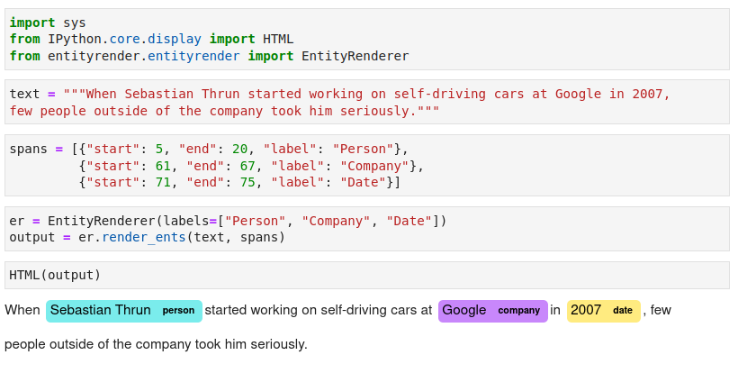

# Simple entity span visualization in text

This is a simple widget, adapted from the code in Spacy visualizers, that can be used for simple visualization of text spans in Jupyter notebooks.

To install:

```
$ pip install entityrender
```

Example code:

```
from IPython.core.display import HTML
from entityrender.entityrender import EntityRenderer

text = """When Sebastian Thrun started working on self-driving cars at Google in 2007,
few people outside of the company took him seriously."""

spans = [{"start": 5, "end": 20, "label": "Person"},
         {"start": 61, "end": 67, "label": "Company"},
         {"start": 71, "end": 75, "label": "Date"}]

er = EntityRenderer(labels=["Person", "Company", "Date"])
output = er.render_ents(text, spans)

HTML(output)

```

Result:

